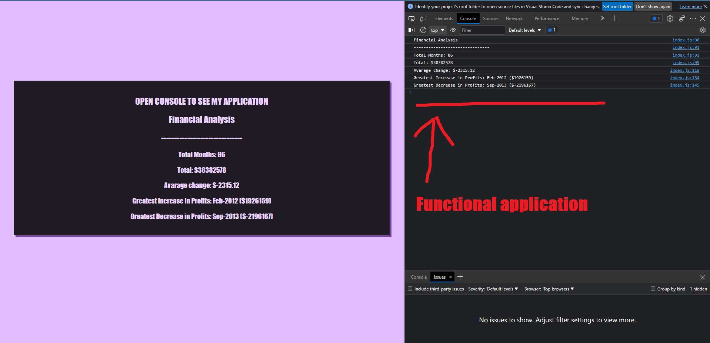

# JS Finances in-console app

## Description
This app was made mainly to practise basics of JavaScript, for loops, if statements, variables and simple arrays.
JavaScript in-console app can:
- count the amount of months,
- add up total of profits,
- calculate average change,
- calculate greatest and lowest changes,
- find months of greatest and lowest change.

## Usage 
Open developer tools and console.
Application only runs in console. 
Can calculate different inputs when added or taken from finances array.

## Screenshot

## Link
[HERE](url) is link to my deployed application.
## Credits
Made by me(FranAli) as BootCamp challange